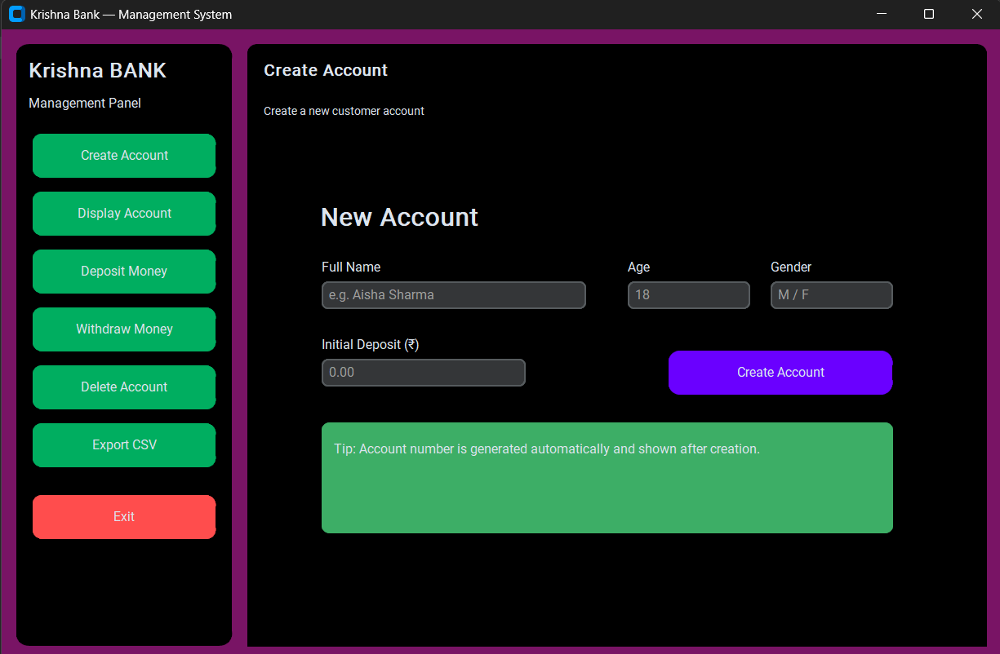

# 🏦 Bank Management System | with User Interface
A modern **Bank Management System** built using **Python** and **MySQL**.  
It provides a clean UI and essential banking operations like account creation, deposit, withdraw, delete, and data export.



---

## 🚀 Features
- 🎨 **Modern CustomTkinter UI**
- ➕ Create new accounts  
- 📄 Display customer details  
- 💰 Deposit & Withdraw  
- ❌ Delete accounts  
- 📤 Export data to CSV  
- 🗄️ MySQL database integration  
- ⚠️ Error handling & confirmation dialogs  

---

## 🛠 Tech Stack

- **Language:** Python 3, MySql
- **Library:** Tkinter(built-in), Customtkinter, Random, CSV
- **Connectivity:** mysql.connector

---

## 📁 Project Structure

```
📁 Bank-Management-System(with UI)/
 ┣ 📄 main.py      # Main app file
 ┣ 📄 README.md          # Project readme (this file)
 ┣ 📷 screenshot.png     # UI image
 ┗ 📝 bank_backup.csv         # Exported backup
```

---

## 🛠️ Requirements

Install dependencies:

```
pip install customtkinter mysql-connector-python
```

🗄️ MySQL Setup
Start your MySQL server.

Create a database:

```
CREATE DATABASE bank;
Create a table:
```
```
CREATE TABLE customers (
    account_no INT PRIMARY KEY,
    name VARCHAR(255),
    balance INT,
    gender VARCHAR(20),
    city VARCHAR(255)
);
```
Update your MySQL connection details in the Python file:
```
mycon = mysql.connector.connect(
    host="localhost",
    user="root",     # change to your username
    passwd="password",       # your MySQL password
    database="bank"
)
```

## 📥 How to Run

1. Make sure Python is installed on your system.`

2. Navigate to the project folder and run:

```
cd Bank-Management-System(with UI)
python main.py
```

🤝 Contributing
Pull requests, issues, or suggestions are welcome.

📜 License
This project is open-source and free to use.